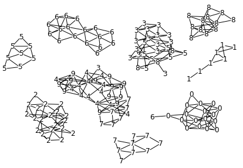

# Mini GNG
A simple version of the Growing Neural Gas algorithm by [Firtzke (1995)](http://citeseerx.ist.psu.edu/viewdoc/download?doi=10.1.1.648.1905&rep=rep1&type=pdf), with some updates suggested in [Ventocilla et al. (2021)](https://www.sciencedirect.com/science/article/pii/S221457962100071X). 

## Install
```bash
pip install git+https://github.com/eliovr/minigng.git
```

Or with optional dependencies to run `example.py`

```bash
pip install git+https://github.com/eliovr/minigng.git#egg=minigng[example]
```

## Example use
```python
import pandas as pd
import numpy as np
from minigng import MiniGNG

df = pd.read_csv("/path/to/iris.csv", header=1)
X = df.drop(df.columns[-1], 1).to_numpy()
y = df[4].to_numpy()

# For clustering just provide 'X'.
gng = MiniGNG(max_units=40, n_epochs=30)
gng.fit(X)
gng.save_gml('iris-clustering.gml')

# For classification provide also 'y'.
gng = MiniGNG(max_units=40, n_epochs=30)
gng.fit(X, y)
gng.save_gml('iris-classification.gml')

# For online training.
gng = MiniGNG(max_units=40, n_epochs=30)
for x in X:
    gng.partial_fit(X)
```

## Screenshots

[Iris](https://archive.ics.uci.edu/ml/datasets/Iris) dataset
```python
gng = MiniGNG(max_units=40, n_epochs=30)
```


[MNIST](http://yann.lecun.com/exdb/mnist/) dataset.
```python
gng = MiniGNG(max_units=150, n_epochs=25, max_edge_age=50, sample=.2, untangle=True, max_size_connect=5)
```



[Fashion MNIST](https://github.com/zalandoresearch/fashion-mnist) dataset.
```python
gng = MiniGNG(max_units=150, n_epochs=20, max_edge_age=30, sample=.3, untangle=True, max_size_connect=0)
```


## Cite

If you make use of the untangling feature (`untangle=True`) please cite:

```bibtex
@article{ventocilla2021,
  title={Scaling the Growing Neural Gas for Visual Cluster Analysis},
  author={Ventocilla, Elio and Martins, Rafael M and Paulovich, Fernando and Riveiro, Maria},
  journal={Big Data Research},
  volume={26},
  pages={100254},
  year={2021},
  publisher={Elsevier}
}
```